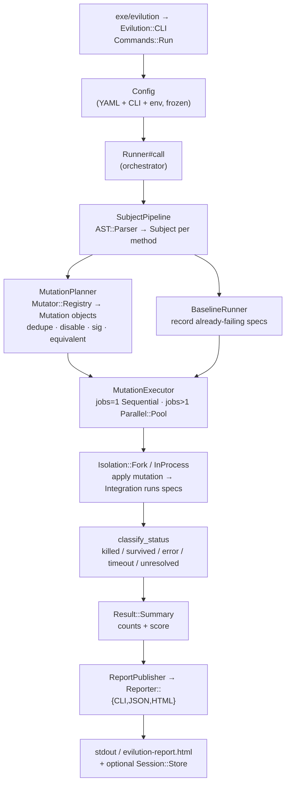

# Architecture (contributor guide)

How evilution turns a source file into a mutation-testing report, and where to
plug in new behavior. This is an internals map for contributors — none of the
classes named here are a public API (see [public_api.md](public_api.md)); they
can move or change in any release.

For deeper dives on two subsystems that have their own docs, see
[isolation.md](isolation.md) (fork vs in-process, sandboxing, signal safety) and
[integrations.md](integrations.md) (RSpec / Minitest / Test::Unit specifics).

## The one-paragraph version

Evilution parses each target file with [Prism](https://github.com/ruby/prism)
into an AST with exact byte offsets. Every method becomes a *subject*. Each
mutation *operator* walks a subject's AST and emits *mutations* — byte-range
edits applied by source-level surgery (no AST unparsing). For every mutation,
evilution copies the file, applies the edit, runs the covering specs in an
isolated worker, and records whether the tests noticed (`killed`) or not
(`survived`). Results are aggregated into a `Summary`, scored, and handed to a
reporter.

## High-level flow



## Module map

Everything lives under `lib/evilution/`.

| Namespace | Responsibility | Key entry points |
|---|---|---|
| `CLI`, `CLI::Commands::*` | Parse argv, build `Config`, dispatch subcommands (`run`, `session`, `compare`), map result to exit code. | `cli.rb`, `cli/commands/run.rb` |
| `Config`, `Config::*` | Merge `.evilution.yml` + CLI flags + env, validate, freeze. | `config.rb`, `config/sources.rb`, `config/validators/*` |
| `Runner`, `Runner::*` | Orchestrate the whole run. Each stage is its own collaborator. | `runner.rb`, `runner/*` |
| `AST`, `Subject` | Prism parse, find method subjects, source surgery, pattern matching, heredoc spans. | `ast/parser.rb`, `ast/source_surgeon.rb`, `subject.rb` |
| `Mutator`, `Mutator::Operator::*` | 74 operators (default profile) that emit byte-edits; registry + profiles. | `mutator/base.rb`, `mutator/registry.rb`, `mutator/operator/*` |
| `Mutation` | An immutable mutation record (original/mutated sources, slice, location, parse status). | `mutation.rb` |
| `SpecResolver`, `SpecSelector` | Map a source file to its covering spec files (layout heuristics + explicit mappings). | `spec_resolver.rb`, `spec_selector.rb` |
| `Isolation::{Fork,InProcess}`, `ProcessSupervisor` | Run one mutation's tests in isolation; process-group lifecycle, sandboxing, TERM/KILL ladder. | `isolation/fork.rb`, `process_supervisor.rb` |
| `Integration::{RSpec,Minitest,TestUnit}` | Apply a mutation and run the configured test framework; report the raw outcome. | `integration/base.rb`, `integration/rspec.rb` |
| `Parallel::{Pool,WorkQueue}` | Fan mutations across worker processes for `jobs > 1`. | `parallel/pool.rb`, `parallel/work_queue.rb` |
| `Result::{MutationResult,Summary}` | Per-mutation result + aggregated, scored summary. | `result/mutation_result.rb`, `result/summary.rb` |
| `Reporter::{CLI,JSON,HTML,Suggestion}` | Render a `Summary` to text / JSON / HTML. | `reporter/*` |
| `Session`, `Compare` | Persist runs to `.evilution/results/*.json`; diff two sessions. | `session/store.rb`, `compare.rb` |
| `Coverage`, `Equivalent`, `Baseline`, `Cache`, `Hooks`, `MCP` | Coverage-based example targeting, equivalent-mutation detection, baseline capture, incremental cache, lifecycle hooks, MCP server. | respective dirs |

## Data flow, source → result

Driven entirely by `Evilution::Runner#call` (`runner.rb:24`). Each step names the
class that owns it.

1. **Config** — `Config#initialize` merges YAML + CLI + env (`Config::Sources.merge`),
   applies `DEFAULTS`, freezes. `Runner#initialize` builds the `AST::Parser`,
   `Mutator::Registry.for_profile(config.profile)`, and (if `incremental`) a `Cache`.
2. **Subjects** — `Runner::SubjectPipeline#call` resolves target files (explicit,
   `source:<glob>`, or `Git::ChangedFiles`), then `AST::Parser#call` runs
   `Prism.parse` and `AST::SubjectFinder` (a `Prism::Visitor`) emits one
   `Evilution::Subject` per `def` node. Optional descendant/target/line-range filters follow.
3. **Baseline** — `Runner::BaselineRunner#call` builds the integration from
   `Runner::INTEGRATIONS` (`rspec`/`minitest`/`test_unit`) and records spec files
   that already fail *before* any mutation, so their mutations aren't miscounted.
   An optional `Runner::Canary` proves the pipeline can observe a known mutation.
4. **Mutations** — `Runner::MutationPlanner#call` flat-maps subjects through
   `Mutator::Registry#mutations_for`. The registry instantiates each operator and
   runs `operator.call(subject, filter:)`; each operator subclasses
   `Mutator::Base` and calls `add_mutation`, which runs `AST::SourceSurgeon` and
   builds an immutable `Evilution::Mutation`. The planner then **deduplicates**
   (by `file_path` + mutated source), and filters **disabled** (`DisableComment`),
   **Sorbet `sig`** (`AST::SorbetSigDetector`), and **equivalent**
   (`Equivalent::Detector`) mutations. Equivalent ones become `:equivalent`
   results directly.
5. **Spec resolution** — per subject, `SpecSelector#call(source_path)` picks specs
   (explicit `spec_files` → `spec_mappings` → `SpecResolver#resolve_specs` layout
   heuristics). Example-level targeting narrows to examples that reference the
   mutated token (`ExampleFilter` / `CoverageExampleFilter`).
6. **Execute** — `Runner::MutationExecutor#call` picks a strategy by `config.jobs`:
   `Strategy::Sequential` for `jobs == 1`, `Strategy::Parallel` (via
   `Parallel::Pool` / `WorkQueue`) for `jobs > 1`. Either way each mutation reaches
   `@isolator.call(mutation:, test_command:, timeout:)`.
7. **Isolate + test** — `Isolation::Fork#call` (default for Rails/gems) spawns a
   sandboxed worker through `ProcessSupervisor#spawn` (own process group, TERM →
   grace → KILL ladder, sandbox reap), applies the mutation
   (`Integration::Loading::MutationApplier`), and runs `Integration::Base#call` →
   `run_tests`. The child's result is marshaled back over a length-prefixed pipe.
   `Isolation::InProcess` is the lighter path for plain-Ruby projects.
8. **Status** — outcome flags come from the integration
   (`Integration::RSpec::ResultBuilder`: passed / test_crashed / examples-loaded
   guard / unresolved); the final symbol is chosen by
   `Isolation::Fork#classify_status`: `:timeout` → `:killed` (crash) →
   `:unresolved` → `:error` → `:survived` (tests passed) → default `:killed`.
   A `NeutralizationPipeline` can reclassify results whose covering spec already
   failed at baseline into `:neutral`.
9. **Aggregate + report** — `Result::Summary` counts each status and computes
   `score = killed / score_denominator` (total minus error/neutral/equivalent/
   unresolved/unparseable). `Runner::ReportPublisher#publish` selects a reporter by
   `config.format` and writes it; `Session::Store` optionally persists the run.
   `Commands::Run` maps `summary.success?(min_score:)` to exit code `0`/`1` (`2` on error).

## How to add a new mutator

A mutator is a `Prism::Visitor` subclass that emits byte-range edits.

1. **Create the operator** in `lib/evilution/mutator/operator/<name>.rb`:

   ```ruby
   # frozen_string_literal: true

   require_relative "../operator"

   class Evilution::Mutator::Operator::MyThing < Evilution::Mutator::Base
     def visit_integer_node(node)          # a Prism visit_*_node hook
       add_mutation(
         offset: node.location.start_offset,
         length: node.location.length,
         replacement: "42",                # the source text to splice in
         node: node
       )
       super                               # ALWAYS call super to keep walking
     end
   end
   ```

   - Implement one or more `visit_<node_type>_node(node)` methods (the Prism node
     names — `visit_call_node`, `visit_if_node`, …). Call `super` so child nodes
     are still visited.
   - Emit edits only through `add_mutation(offset:, length:, replacement:, node:)`.
     It handles heredoc-span extension, the mutation filter, source surgery, and
     builds the immutable `Mutation`. Never edit source strings directly.
   - The operator's registered name is auto-derived from the class name
     (`MyThing` → `my_thing`); that string is the `operator` field in JSON output
     and is part of the public contract, so name it deliberately.

2. **Require it** in `lib/evilution.rb` alongside the other
   `require_relative "evilution/mutator/operator/..."` lines.

3. **Register it** in `lib/evilution/mutator/registry.rb`: add the class to the
   `default` list (runs in every profile) — or, for an aggressive operator meant
   only for `profile: strict`, to `STRICT_EXTRA_OPERATORS` instead.

4. **Test it** under `spec/evilution/mutator/operator/<name>_spec.rb`, mirroring an
   existing operator spec. Adding an operator to the `default` profile shifts
   mutation scores and is a **MINOR** version bump (see [versioning.md](versioning.md)).

## How to add a new reporter

A reporter is `.new(**opts)` + `#call(summary) -> String`. It consumes a frozen
`Evilution::Result::Summary` and returns the rendered report body.

1. **Create the reporter** in `lib/evilution/reporter/<format>.rb`:

   ```ruby
   # frozen_string_literal: true

   require_relative "../reporter"

   class Evilution::Reporter::Csv
     def initialize(integration: :rspec)   # keyword args only; keep them optional
       @integration = integration
     end

     def call(summary)                      # returns a String
       # read summary.results, summary.score, summary.killed, summary.survived,
       # summary.survived_results, etc. — see Result::Summary for the full API
       "..."
     end
   end
   ```

   The `Summary` API a reporter reads includes: counts (`total`, `killed`,
   `survived`, `errors`, `neutral`, `equivalent`, `unresolved`, `unparseable`,
   `timed_out`), metrics (`score`, `score_denominator`, `success?(min_score:)`,
   `efficiency`, `peak_memory_mb`), the raw `results`, and filtered lists
   (`survived_results`, `killed_results`, …). Each result exposes `mutation`
   (`operator_name`, `file_path`, `line`, `diff`), `status`, `duration`, and
   status predicates (`killed?`, `survived?`, …).

2. **Require it** in `lib/evilution.rb` (next to the other `reporter/*` requires)
   **and** in `lib/evilution/runner.rb` (the runner requires reporters
   independently, near the bottom of the file).

3. **Wire the dispatch** in `Runner::ReportPublisher#build_reporter`
   (`runner/report_publisher.rb`): add a `when :csv` branch returning your class,
   and a matching `require_relative "../reporter/csv"` at the top. If the output
   should go to a file rather than stdout, extend the `#publish` write branch
   (only `:html` writes a file today; every other format is `$stdout.puts`ed).

4. **Advertise the value.** There is no strict format allowlist to update —
   `config.format` is only `to_sym`'d, not validated — but update the
   `--format` help string in `cli/parser/options_builder.rb` so `csv` is
   discoverable. (The `compare` subcommand keeps its *own* `SUPPORTED_FORMATS`
   list; touch it only if `compare` should support the new format too.)

Adding a new format is additive — a **MINOR** bump.

## How to add a new test integration (bonus)

Integrations subclass `Evilution::Integration::Base` (`integration/base.rb`),
which defines the contract: class methods `baseline_runner` / `baseline_options`,
and instance methods `run_tests(mutation)`, `ensure_framework_loaded`,
`build_args(mutation)`, `reset_state` (each `raise NotImplementedError` until
overridden). `Base#call` already handles applying the mutation and firing
`mutation_insert_pre/post` hooks. Register the new class in
`Runner::INTEGRATIONS` (`runner/baseline_runner.rb`) and allow its symbol in the
integration config validator. See [integrations.md](integrations.md) for the
framework-specific details.
